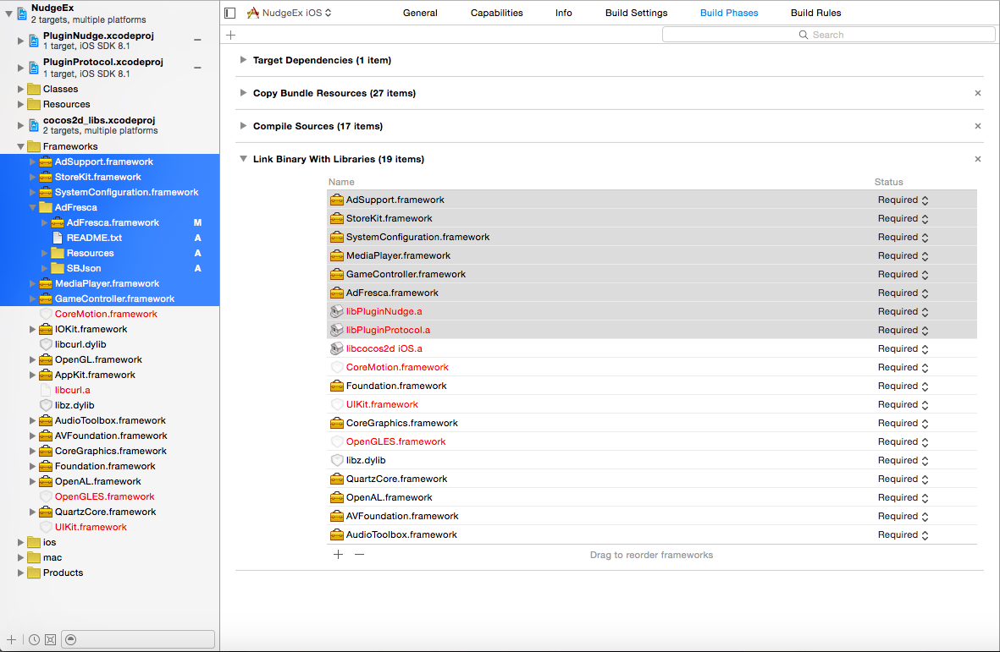
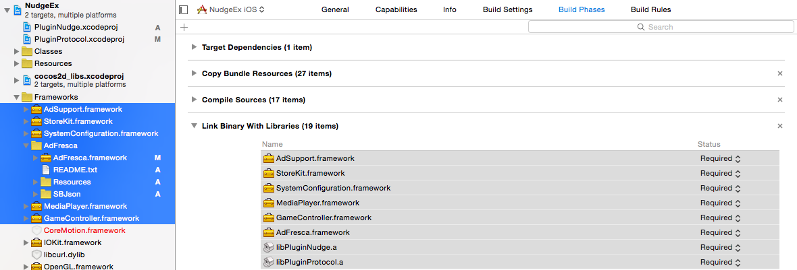
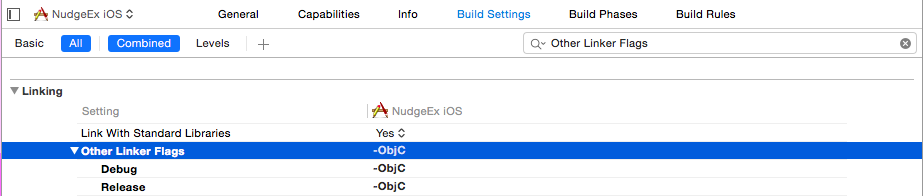
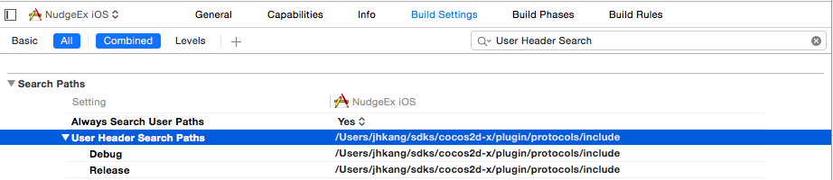

## Contents
- [Basic Integration](#basic-integration)
  - [Installation](#installation)
  - [Start Session](#start-session)
  - [In-App Messaging](#in-app-messaging)
  - [Push Messaging](#push-messaging)
  - [Test Device Registration](#test-device-registration)
- [IAP, Reward and Sales Promotion](#iap-reward-and-sales-promotion)
  - [In-App Purchase Tracking](#in-app-purchase-tracking)
  - [Give Reward](#give-reward)
  - [Sales Promotion](#sales-promotion)
- [Dynamic Targeting](#dynamic-targeting)
  - [Custom Parameter](#custom-parameter)
  - [Stickiness Custom Parameter](#stickiness-custom-parameter)
  - [Marketing Moment](#marketing-moment)
- [Advanced](#advanced)
  - [ShowFinishCallback](#showfinishcallback)
  - [Timeout Interval](#timeout-interval) 
- [Reference](#reference)
  - [Deep Link](#deep-link)
  - [Cross Promotion Configuration](#cross-promotion-configuration)
  - [Google Referrer Tracking](#google-referrer-tracking)
  - [Image Push Notification](#image-push-notification)
  - [Proguard Configuration](#proguard-configuration)
  - [IFV Only Option](#ifv-only-option)
- [Troubleshooting](#troubleshooting)
- [Release Notes](#release-notes)

* * *

## Basic Integration

### Installation

1) 아래 링크를 통해 _COCOS2DX Plugin_을 다운로드 합니다.  
[cocos2dx Plugin 다운로드]()

2) 환경변수에 __COCOS2DX_ROOT__ 가 등록되어 있는지 확인합니다.

3) copy_plugin.sh를 실행합니다.  
아래의 구성요소들이 COCOS2D-X SDK폴더안에 있는 plugin폴더에 추가되어야 합니다.  
plugins/  

    nudge  
protocols/include/  

    NudgeAgent.h  
    NudgeException.h  
    NudgePurchase.h  
    NudgeRewardItem.h  
protocols/platform/android/  

    NudgeAgent.cpp  
    NudgeException.cpp  
    NudgePurchase.cpp  
    NudgeRewardItem.cpp
protocols/platform/ios/  

    NudgeAgent.mm  
    NudgeException.mm  
    NudgePurchase.mm  
    NudgeRewardItem.mm

이제 각 플랫폼에 맞게 설치 작업을 진행합니다.

#### iOS
1) COCOS2D-X SDK 폴더에서 아래의 구성요소를 프로젝트에 Drag & Drop 하여 추가합니다.  
	(PluginProtocol.xcodeproj의 경우 이미 등록된 파일이 있다면 생략합니다.)

{COCOS2DX SDK ROOT 폴더}/plugin/protocols/proj.ios/
	
    PluginProtocol.xcodeproj  
{COCOS2DX SDK ROOT 폴더}/plugin/plugins/nudge/proj.ios/  

    PluginNudge.xcodeproj


PluginProtocol.xcodeproj에 아래와 같이 파일을 추가합니다.
- include폴더에 플러그인 해더 파일을 추가합니다.
	- 헤더파일 경로 : {COCOS2DX SDK ROOT 폴더}/plugin/protocols/include/
```
NudgeAgent.h  
NudgeException.h  
NudgePurchase.h  
NudgeRewardItem.h
```

- ios 폴더에 플러그인 소스 파일을 추가합니다.
    - 소스파일 경로 : {COCOS2DX SDK ROOT 폴더}/plugin/protocols/platform/ios/
```
NudgeAgent.mm  
NudgeException.mm  
NudgePurchase.mm  
NudgeRewardItem.mm
```


2) {COCOS2DX SDK ROOT 폴더}/plugin/plugins/nudge/proj.ios/Frameworks/AdFresca 폴더를 Xcode 프로젝트에 Drag & Drop 하여 추가합니다.


3) libPluginNudge.a, libPluginProtocol.a, GameController.framework, MediaPlayer.framework, System Configuration.framework, StoreKit.framework, AdSupport.framework(선택)를 Xcode 프로젝트에 추가합니다.





  
  - AdSupport.framework를 추가할 경우, SDK는 [IFA(Identifier For Advertisers)](https://developer.apple.com/library/ios/documentation/AdSupport/Reference/ASIdentifierManager_Ref/ASIdentifierManager.html#jumpTo_3) 값을 수집하여 디바이스(=앱 사용자) 구분에 사용합니다. Nudge SDK는 IFA 값을 사용하여 크로스 프로모션 캠페인 기능을 제공하고 캠페인 노출 이후 사용자의 앱 설치 및 액션 트랙킹을 위해 사용하고 있습니다. 
  - AdSupport.framework를 제외할 경우, [IFV(Identifier For Vendor)](https://developer.apple.com/library/ios/documentation/uikit/reference/UIDevice_Class/Reference/UIDevice.html#jumpTo_7) 값을 사용합니다. 이 경우 크로스 프로모션 캠페인 기능을 이용할 수 없으며 IFV의 특성상 사용자가 앱을 삭제하고 재설치할 때 새로운 디바이스(=앱 사용자)로 인식될 수 있습니다. 

  만약, 앱 업데이트 과정에서 AdSupport.framework를 제외하거나 새로 추가하는 경우 [IFV Only Option](#ifv-only-option) 항목의 내용을 참고하여 주시기 바랍니다.

4) Build Setting의 Other Linker Flags 값을 –ObjC로 설정 혹은 추가,
User Header Search Paths 값에 {COCOS2DX SDK ROOT 폴더}/plugin/protocols/include를 절대경로 혹은 상대경로로 추가합니다. 




5) Info.plst 파일의 'aps-environment' 값을 'production' 으로 설정합니다. (Push Notification 적용 시 반드시 확인해주시기 바랍니다.)

  

  만약 앱이 가로 방향만을 지원한다면 'Initial interface orientation' 값을 'Landscape (right home button)' 으로 설정합니다.

  마지막으로, URL Scheme 값을 지정합니다. 아래의 예제는 'myapp' 이라는 스키마 값을 지정한 예제입니다. 해당 값은 크로스 프로모션 기능을 이용하기 위하여 사용됩니다.

  

아무런 에러 없이 빌드가 성공헀다면 모든 설치가 정상적으로 완료된 것입니다. 만약 Duplicate Symbol 등의 Linking Error 가 발생하였다면 아래의 '[Troubleshooting](#troubleshooting)' 항목을 확인해주시기 바랍니다

#### Android

1) {COCOS2D-X SDK ROOT 폴더}/plugin/protocols/proj.android/jni/Anroid.mk를 다음과 같이 수정합니다.
```makefile
...
LOCAL_SRC_FILES :=\
$(addprefix ../../platform/android/, \
...
# prefix부분에 Nudge소스들을 추가합니다.
NudgeAgent.cpp \
NudgePurchase.cpp \
NudgeRewardItem.cpp \
NudgeException.cpp \
) \
...
```
2) {COCOS2D-X SDK ROOT 폴더}/plugin/tools/config.sh를 다음과 같이 수정합니다.
(Cocos2D-X 3.3 이후 버전, Plugin-X 최신 버전인경우 해당 부분 진행시 ALL_PLUGINS가 없을수 있으며, 그 경우는 이 단계를 건너 뛰고 진행합니다.)
```sh
#define plugins array 
export ALL_PLUGINS=( ... \
...
# ALL_PLUGINS에 nudge를 추가합니다.
"nudge" \
)
...
```

3) Nudge SDK 폴더에 있는 install_android.sh를 실행후 지시에 따라 진행합니다.  
(지시에 나오는 모든 경로는 절대경로를 넣어주세요.)  

4) Game Project폴더에 proj.android/jni/Android.mk를 수정합니다.
```mk
include $(CLEAR_VARS)
...
# call import-add-path 끝부분에 이어서 추가합니다. 
# $(COCOS2DX_ROOT)는 환경변수 입니다.
$(call import-add-path,$(COCOS2DX_ROOT)/plugin/publish)
...
LOCAL_MODULE := cocos2dcpp_shared
```

5) Game Project폴더에 proj.android/jni/hellocpp/main.cpp를 수정합니다.
```cpp
...
#include "PluginJniHelper.h"
...
void cocos_android_app_init(JNIEnv* env, jobject thiz) {
    ...
	// init부분 맨 마지막에 해당 코드를 추가합니다.
    JavaVM* vm;
    env->GetJavaVM(&vm);
    PluginJniHelper::setJavaVM(vm);
}
```
6) Game Project폴더에 proj.android/src/org/cocos2dx/cpp/AppActivity.java
```java
...
import org.cocos2dx.lib.Cocos2dxGLSurfaceView;
import org.cocos2dx.plugin.PluginWrapper;
...
public class AppActivity extends Cocos2dxActivity {
    ...
    // onCreateView()를 다음과 같이 추가합니다.
    @Override
    public Cocos2dxGLSurfaceView onCreateView() {
        Cocos2dxGLSurfaceView glSurfaceView = new Cocos2dxGLSurfaceView(this);
        glSurfaceView.setEGLConfigChooser(5, 6, 5, 0, 16, 8);

        PluginWrapper.init(this);
        PluginWrapper.setGLSurfaceView(glSurfaceView);

        return glSurfaceView;
    }
    ...
}
```

### Start Session

이제 플러그인을 적용을 시작하기 위해 몇 가지 간단한 코드를 적용합니다. 첫 번째로 API Key를 설정하고 앱의 실행을 기록하는 StartSession() 메소드를 적용합니다. API Key는 [Dashboard](https://admin.adfresca.com) 사이트에서 등록한 앱을 선택한 후 Overview 메뉴의 Settings - API Keys 버튼을 클릭하여 확인이 가능합니다. 

게임이 실행되는 시점에서 StartSession(const char* apiKey) 메소드를 실행합니다.

```cpp
#include "NudgeAgent.h"
...
bool AppDelegate::applicationDidFinishLaunching()
{
...
#if (CC_TARGET_PLATFORM == CC_PLATFORM_IOS)
plugin::NudgeAgent::getInstance()->startSession("YOUR_IOS_API_KEY");
#elif (CC_TARGET_PLATFORM == CC_PLATFORM_ANDROID)
plugin::NudgeAgent::getInstance()->startSession("YOUR_ANDROID_API_KEY");
#endif
...
}

```


### In-App Messaging

인-앱 메시징 기능을 이용하여, 사용자에게 원하는 메시지를 실시간으로 전달할 수 있습니다. 메시지를 전달하고자 하는 시점에 제공되는 load(), show() 메소드만을 호출하여 적용이 가능합니다. 메시지는 전면 interstitial 이미지, 텍스트, 혹은 iframe 웹페이지 형태로 게임 화면에 표시될 수 있습니다. 메시지는 현재 게임을 플레이 중인 사용자가 인-앱 메시징 캠페인의 조건과 매칭된 경우에만 화면에 표시됩니다. 조건에 만족하는 캠페인이 없다면 사용자는 아무런 화면을 보지 않고 자연스럽게 게임 플레이를 이어갑니다. 매칭과 관련한 인-앱 메시징의 다이나믹 타겟팅 기능은 아래의 [Dynamic Targeting](#dynamic-targeting) 항목에서 보다 자세히 설명하고 있습니다.

```cpp
#include "NudgeAgent.h"
...
void AScene::A()
{
	plugin::NudgeAgent* nudge = plugin::NudgeAgent::getInstance();
    nudge->load();
    nudge->show();
}
```

첫 번째로 인-앱 메시징 코드를 적용한 경우, 아래와 같이 테스트 이미지 메시지가 표시됩니다. 해당 이미지를 터치하면 앱스토어 페이지로 이동합니다. 현재 보고 있는 테스트 메시지는 이후 테스트 모드 설정을 변경하여 더이상 보이지 않도록 설정하게 됩니다.


&nbsp;


### Push Messaging

푸시 메시징 기능을 이용하여 사용자가 게임을 플레이하지 않을 때에도 언제든 메시지를 전달할 수 있습니다. 아래의 플랫폼 별 적용 과정을 통하여 푸시 메시징 기능을 적용합니다.

#### Android

SDK를 적용하기 이전에 [Google API Console](https://cloud.google.com/console) 사이트에서 프로젝트를 생성하고, [Dashboard](https://admin.adfresca.com) 사이트에 설정할 GCM API Key 및 SDK 적용에 필요한 GCM_SENDER_ID (Project Number) 값을 얻어야 합니다.

'[Android Push Notification 설정 및 적용하기 (GCM)](https://adfresca.zendesk.com/entries/28526764)' 가이드를 참고하여 필요한 값들을 얻습니다.

이제 SDK 적용을 시작합니다.


1) AndroidManifest.xml 내용 추가하기

```xml
<manifest>   
  <application>
      .........
      <receiver android:name="YOUR.PACKAGE.NAME.GCMReceiver"
        android:permission="com.google.android.c2dm.permission.SEND">  
        <intent-filter>
          <action android:name="com.google.android.c2dm.intent.RECEIVE" />
          <action android:name="com.google.android.c2dm.intent.REGISTRATION" />
          <category android:name="YOUR.PACKAGE.NAME" />
         </intent-filter>
      </receiver>
      <service android:name="YOUR.PACKAGE.NAME.GCMIntentService" />  

      <activity android:name="com.adfresca.ads.AdFrescaPushActivity" />
      ..........
   </application>
    ..........
    <permission android:name="YOUR.PACKAGE.NAME.permission.C2D_MESSAGE" android:protectionLevel="signature" />
    <uses-permission android:name="YOUR.PACKAGE.NAME.permission.C2D_MESSAGE" />
    <uses-permission android:name="com.google.android.c2dm.permission.RECEIVE" />
    <uses-permission android:name="android.permission.GET_ACCOUNTS" />
    <uses-permission android:name="android.permission.WAKE_LOCK" />

    <uses-permission android:name="android.permission.SYSTEM_ALERT_WINDOW"/>
    <uses-permission android:name="android.permission.READ_PHONE_STATE" /> 
    <uses-permission android:name="android.permission.VIBRATE" />
    ..........
</manifest>
```

- GCMReceiver 클래스와 GCMIntentService 클래스는 이미 적용 중인 내용이 있다면 그대로 사용하여 SDK 코드만 추가합니다. 
- 만약 기존에 사용 중인 GCM 클래스가 없다면, 샘플로 제공되는 [GCMReceiver](https://gist.github.com/sunku/29906033dcee764ef022) 및 [GCMIntentService](https://gist.github.com/sunku/05c5e4feb3d0fb8d4088) 소스코드를 참고하여 클래스를 작성합니다.해야 합니다.

2) GCMIntentService 클래스 구현하기

```java
protected void onRegistered(Context context, String registrationId) {
	AdFresca.handlePushRegistration(registrationId);
}

protected void onUnregistered(Context context, String registrationId) {
	AdFresca.handlePushRegistration(null);
}

protected void onMessage(Context context, Intent intent) {
      // Check if this notification is from Nudge
      if (AdFresca.isFrescaNotification(intent)) {

        Class<?> targetActivityClass = AppActivity.class;
        String appName = context.getString(R.string.app_name);
        int icon = R.drawable.icon;
        long when = System.currentTimeMillis();

        // Show this message
        AFPushNotification notification = AdFresca.generateAFPushNotification(context, intent, targetActivityClass, appName, icon, when);
        notification.setDefaults(Notification.DEFAULT_ALL); 
        AdFresca.showNotification(notification);
    }
}
```
- 푸시 메시지에 Deep Link가 포함되어 있다면, 사용자가 메시지 터치 시에 SDK는 해당 URL을 실행합니다.
- 푸시 메시지에 Deep Link가 없다면, SDK는 targetActivityClass를 실행하여 앱을 실행합니다. 
- notification.setSound(uri) 메소드를 이용하면 메시지 수신 시에 사운드 파일을 재생할 수도 있습니다.

3) GCMReceiver 클래스 구현하기

```java
@Override
protected String getGCMIntentServiceClassName(Context context) { 
	return "YOUR.PACKAGE.NAME.GCMIntentService"; 
} 
```

4) Cocos2D-X Game프로젝트에서 AppDelegate.cpp파일에 GCM 적용하기

이제 Cocos2D-X코드에서 GCM Sender ID 값을 플러그인에 설정하여 적용을 완료합니다. 만약 기존에 사용 중인 GCM 서비스가 있어 이미 디바이스의 GCM 푸시 고유 아이디를 알고 있는 경우, setPushRegistrationIdentifier(const char*) 메소드를 호출하여 값만 설정하는 것도 가능합니다.

```cpp
bool AppDelegate::applicationDidFinishLaunching()
{
	plugin::NudgeAgent* nudge = plugin::NudgeAgent::getInstance();

	nudge->setGCMSenderID(GCM_SENDER_ID);  // Google API Proejct Number (ex: 12345678)
	// nudge->setPushRegistrationIdentifier("DEVICE_GCM_PUSH_REG_ID"); // if you already have it

	nudge->startSession(API_KEY);
}
```

#### iOS

1) APNS 인증서 파일(.p12)을 Dashboard에 등록하기
  - Keychain 툴을 이용하여 .cer 인증서 파일을 .p12로 변환하고 [Dashboard](https://admin.adfresca.com) 사이트에 등록합니다.
  - 보다 자세한 설명은 [iOS Push Notification 인증서 설정 및 적용하기](https://adfresca.zendesk.com/entries/21714780) 가이드를 통하여 확인이 가능합니다.

2) Info.plast 확인하기 / Provision 확인하기
- Nudge는 APNS의 Production 환경만을 지원합니다. 때문에 게임 빌드가 production으로 빌드되어야 정상적인 서비스 이용이 가능합니다.
- Info.plst 파일의 'aps-environment' 값을 'production' 으로 설정되어 있어야 합니다.
- App Store / Ad Hoc release에 사용하는 Provision 인증서를 사용하여 빌드되어야 합니다.

3) AppController.mm 코드 적용하기 

```mm
#import <AdFresca/AdFrescaView.h>

- (BOOL)application:(UIApplication *)application didFinishLaunchingWithOptions:(NSDictionary *)launchOptions {
  ....
  if ([application respondsToSelector:@selector(registerUserNotificationSettings:)]) {
    UIUserNotificationType types = (UIUserNotificationTypeAlert | UIUserNotificationTypeBadge | UIUserNotificationTypeSound);
    UIUserNotificationSettings *notificationSettings = [UIUserNotificationSettings settingsForTypes:types categories:nil];
    [application registerUserNotificationSettings:notificationSettings];
    [application registerForRemoteNotifications];
  } else {
    [application registerForRemoteNotificationTypes:(UIRemoteNotificationTypeBadge | UIRemoteNotificationTypeAlert | UIRemoteNotificationTypeSound)];
  }

  NSDictionary* userInfo = [launchOptions objectForKey:UIApplicationLaunchOptionsRemoteNotificationKey];
  if (userInfo != nil) {
    [self application:application didReceiveRemoteNotification:userInfo];
  }
} 

- (void)application:(UIApplication *)application didRegisterForRemoteNotificationsWithDeviceToken:(NSData *)deviceToken {
  [AdFrescaView registerDeviceToken:deviceToken];
}

- (void)application:(UIApplication *)application didReceiveRemoteNotification:(NSDictionary *)userInfo {
  if ([AdFrescaView isFrescaNotification:userInfo] && [application applicationState] != UIApplicationStateActive) {
    [AdFrescaView handlePushNotification:userInfo];
  }
} 
```

이로써 푸시 메시징 기능을 위한 적용 작업이 모두 완료되었습니다.

### Test Device Registration

Nudge는 테스트 모드 기능을 지원하여 테스트를 원하는 디바이스에만 원하는 메시지를 전달할 수 있습니다. 이로 인해 SDK가 적용된 앱이 이미 앱스토어에 출시된 경우, 게임 운영팀 혹은 개발팀에게만 새로운 메시지를 전달하여 테스트할 수 있도록 지원합니다.

테스트 기기 등록을 위한 아이디 값은 SDK를 통해 추출이 가능하며 2가지 방법을 지원 합니다.

1) testDeviceId 값을 직접 얻어와서 로그로 출력하는 방법

```cpp
plugin::NudgeAgent* nudge = plugin::NudgeAgent::getInstance();
nudge->startSession(API_KEY);

#if (CC_TARGET_PLATFORM == CC_PLATFORM_IOS)
	log(nudge->getTestDeviceId().c_str(), "");
#elif (CC_TARGET_PLATFORM == CC_PLATFORM_ANDROID)
	nudge->printTestDeviceId();
#endif
```

2) setPrintTestDeviceId() 메소드를 사용하여 화면에 Device ID를 표시하는 방법

```cpp
plugin::NudgeAgent* nudge = plugin::NudgeAgent::getInstance();
nudge->startSession(API_KEY);

nudge->setPrintTestDeviceId(true);
nudge->load();
nudge->show();
```

테스트 디바이스 아이디를 확인한 이후에는, [Dashboard](https://admin.adfresca.com)를 접속하여 'Test Device' 메뉴를 통해 디바이스 등록이 가능합니다.

* * *

## IAP, Reward and Sales Promotion

### In-App Purchase Tracking

_In-App-Purchase Tracking_  기능을 통하여 현재 앱에서 발생하고 있는 모든 인-앱 결제를 분석하고 캠페인 타겟팅에 이용할 수 있습니다.

Nudge의 In-App-Purchase Tracking은 2가지 유형이 있습니다.

1. 실제 화폐를 통해 결제되는 Hard Currency Item Purchase Tracking (예: USD $1.99를 결제하여 Gold 100개 아이템을 구입)
2. 가상 화폐를 통해 결제되는 Soft Currency Item Purchase Tracking (예: Gold 10개를 이용하여 포션 아이템을 구입)

위 2가지 유형의 데이터를 모두 Tracking 함으로써 앱의 매출뿐만 아니라 인-앱 사용자들의 아이템 구매 추이 분석까지 가능합니다.

아이템 정보 등록을 위한 별도의 작업은 필요하지 않으며, 클라이언트에서 결제된 아이템 정보가 자동으로 대쉬보드에 등록되는 방식입니다. (아이템 리스트 확인은 대쉬보드 'Overview' 메뉴의 Settings - In App Items 페이지를 통해 확인할 수 있습니다.)

아래의 적용 예제를 참고하여 간단히 In-App-Purchase Tracking 기능을 적용합니다.

### Hard Currency Item Tracking

Hard Currency Item의 결제는 각 앱스토어별 인-앱 결제 라이브러리를 통해 이루어집니다. 각 결제 라이브러리에서 _'결제 성공'_ 이벤트가 발생 할 시에 Purchase 객체를 생성하고 logPurchase(purchase) 메소드를 호출합니다. 그리고 _'결제 실패'_ 이벤트가 발생 할 시에는 cancelPromotionPurchase() 메소드를 호출합니다.

적용 예제 1: Cocos2D-X 환경에서 결제 성공 이벤트 발생 시
```cpp
using namespace cocos2d::plugin;
void Scene::onHardItemPurchased() 
{
	std::map<std::string, std::string> receiptMap;
    receiptMap["orderId"] = "google_play_order_ID";
    receiptMap["receiptData"] = "google_play_receipt_data_json";
    receiptMap["signature"] = "google_play_signature";
    
    NudgePurchase* purchase = new NudgePurchase(NudgePurchase::TYPE::TYPE_HARD);
    purchase->setItemId("gold100")
    			->setItemName("100 Gold")
                ->setCurrencyCode("USD")
                ->setPrice(0.99)
                ->setPurchaseDate(purchaseDateTimeString)
                ->setReceipt(receiptMap);
    NudgeAgent::getInstance()->logPurchase(purchase);
}

void Scene::onPurchaseHardItemFailure() 
{
	NudgeAgent::getInstance()->cancelPromotionPurchase();
}
```

Hard Currency Item을 위한 PurchaseBuilder의 보다 자세한 설명은 아래와 같습니다.

Method | Description
------------ | ------------- | ------------
setItemId(std::string) | 결제한 아이템의 고유 식별 아이디를 설정합니다. 등록된 앱스토어에 상관 없이 앱내에서 고유한 식별 값을 이용하는 것을 권장합니다. Nudge 대쉬보드에서 해당 값을 기준으로 아이템 목록이 생성됩니다. 
setItemName(std::string) | 결제한 아이템의 이름을 설정합니다. 이 값은 대쉬보드에서 이름을 표시하기 위한 용도로만 이용됩니다. 등록된 이름은 언제든지 대쉬보드에서 변경이 가능합니다. 
setCurrencyCode(std::string) | ISO 4217 표준 코드를 설정합니다. Google Play의 경우 'Default price' 에 설정되는 Currency Code 값을 이용하며 타 결제 라이브러리의 경우는 보통 이용 가능한 Currency Code가 고정되어 있습니다 (예: 아마존은 USD, 티스토어는 KRW). 또는 자체 백엔드 서버에서 결제하는 아이템의 Currency Code를 내려받아 설정할 수 있습니다.
setPrice(double) | 아이템의 가격을 설정합니다. 결제 라이브러리에서 주는 값을 이용하거나, 자체 백엔드 서버에서 가격을 내려받아 설정할 수 있습니다. 
setPurchaseDate(std::string) | 결제된 시간을 문자열로 설정합니다. 값이 설정되지 않은 경우 Nudge 서비스에 기록되는 시간이 결제 시간으로 자동 설정됩니다.
setReceipt(std::map&lt;std::string, std::string&gt;) | 추후 Receipt Verficiation 기능을 위해 필요한 데이터를 설정합니다. 현재 버전의 SDK는 Google Play만 지원하며 타 결제 라이브러리의 경우는 값을 설정하지 않습니다.

### Soft Currency Item Tracking

Soft Currency Item의 결제는 앱 내의 가상 화폐로 아이템을 결제한 경우를 의미합니다. 앱 내에서 가상 화폐를 이용한 결제 이벤트가 성공한 경우 아래 예제와 같이 Purchase 객체를 생성하고 logPurchase(purchase) 메소드를 호출합니다. 그리고 _'결제 실패'_ 이벤트가 발생 할 시에는 cancelPromotionPurchase() 메소드를 호출합니다.

적용 예제: 
```cpp
using namespace cocos2d::plugin;
void Scene::onSoftItemPurchased()
{
    NudgePurchase* purchase = new NudgePurchase(NudgePurchase::TYPE::TYPE_SOFT);
    purchase->setItemId("long_sword")
    			->setItemName("Long Sword")
                ->setCurrencyCode("gold")
                ->setPrice(100)
                ->setPurchaseDate(purchaseDateTimeString); // std::string
    NudgeAgent::getInstance()->logPurchase(purchase);
}

void Scene::onPurchaseSoftItemFailure()
{
	NudgeAgent::getInstance()->cancelPromotionPurchase();
}
```

Soft Currency Item을 위한 PurchaseBuilder의 보다 자세한 설명은 아래와 같습니다.

Method | Description
------------ | ------------- | ------------
setItemId(std::string) | 결제한 아이템의 고유 식별 아이디를 설정합니다. 등록된 앱스토어에 상관 없이 앱내에서 고유한 식별 값을 이용하는 것을 권장합니다. Nudge 대쉬보드에서 해당 값을 기준으로 아이템 목록이 생성됩니다. 
setItemName(std::string) | 결제한 아이템의 이름을 설정합니다. 이 값은 대쉬보드에서 이름을 표시하기 위한 용도로만 이용됩니다. 등록된 이름은 언제든지 대쉬보드에서 변경이 가능합니다. 
setCurrencyCode(std::string) | 결제에 사용한 가상화폐 고유 코드를 설정합니다. (예: gold)
setPrice(double) | 가상 화폐로 결제한 가격 정보를 설정합니다. (예: gold 10개의 경우 10 값을 설정)
setPurchaseDate(std::string) | 결제된 시간을 문자열 형태로 설정합니다. 값이 설정되지 않은 경우 Nudge 서비스에 기록되는 시간이 결제 시간으로 자동 설정됩니다.

### IAP Trouble Shooting

logPurchase() 메소드를 통해 기록된 Purchase 객체는 Nudge 서비스에 업데이트되어 실시간으로 대쉬보드에 반영됩니다. 현재까지 등록된 아이템 리스트는 'Overview' 메뉴의 Settings - In App Items 페이지를 통해 확인할 수 있습니다.

만약 아이템 리스트가 새로 갱신되지 않는 경우, nudge::PurchaseExceptionCallback을 구현하여 혹시 에러가 발생하고 있지 않은지 확인해야 합니다. Purchase 객체의 값이 제대로 설정되지 않은 경우, nudge::PurchaseExceptionCallback을 통하여 에러 메시지가 표시됩니다.

nudge::PurchaseExceptionCallback을 구현하는 방법이 여러가지가 있으나 그중 2가지 방법은 다음과 같습니다.  
1) c++11 Lambda functions 사용
```cpp
......
NudgeAgent::getInstance()->logPurchase(purchase, [](plugin::NudgePurchase* purchase, plugin::NudgeException* ex)
{
	log(purchase->getPurchaseToJson().c_str(), "");
    log(ex->getExceptionToJson().c_str(), "");
});
```

2) c++11 functional bind 사용
```cpp
#include <functional>

void Scene::onSoftItemPurchased()
{
    ......
    NudgeAgent::getInstance()->logPurchase(purchase, 
    	std::bind(&Scene::onPurchaseException, this, std::placeholders::_1, std::placeholders::_2));
}

void Scene::onPurchaseException(plugin::NudgePurchase* purchase, plugin::NudgeException* ex)
{
	log(purchase->getPurchaseToJson().c_str(), "");
    log(ex->getExceptionToJson().c_str(), "");
}
```

* * *

### Give Reward

Reward 기능을 적용하여 현재 사용자에게 지급 가능한 보상 아이템이 있는지 확인하고, 지정된 보상 아이템을 사용자에게 지급할 수 있습니다.

Reward 캠페인의 'Reward Item' 항목을 설정했거나, Incentivized CPI & CPA 캠페인의 'Incentive Item' 을 설정한 경우 사용자에게 보상 아이템이 지급됩니다.

먼저 AndroidManifest.xml 내용을 확인합니다.

```xml
<manifest>   
  <application>
      .........
      <activity android:name="com.adfresca.sdk.reward.AFRewardActivity" />
      .........
   </application>
</manifest>
```

이제 구현을 위해서 아래 코드를 사용합니다.
- checkRewardItems(): 현재 지급 가능한 보상 아이템이 있는지 검사합니다. 사용자가 앱을 실행할 호출하는 것을 권장합니다.
- setRewardItemCallback(): 아이템 지급 조건이 만족되면 이벤트가 발생하도록 설정할 수 있습니다. 이벤트를 발생시킬 메소드를 지정합니다.

**Cocos2D-X 코드 적용하기**

```cpp
bool AppDelegate::applicationDidFinishLaunching()
{
    ...
    NudgeAgent* nudge = NudgeAgent::getInstance();
    nudge->setGCMSenderID(GCM_SENDER_ID);
    nudge->startSession("API_KEY");

    nudge->setRewardItemCallback();
    nudge->checkRewardItems([](NudgeRewardItem* rewardItem)
    {
        log(rewardItem->getRewardItemToJson().c_str(), "");
        sendItemToUser(currentUserId, rewardItem->getUniqueValue(), rewardItem->getQuantity(), 
                        rewardItem->getSecurityToken());
    });
    ...
}
```

캠페인 종류에 따라 onReward 이벤트의 발생 조건이 다릅니다.

- Reward 캠페인: 캠페인이 앱 사용자에게 매칭되어 노출될 때 이벤트가 발생합니다
- Incentivized CPI 캠페인: 사용자의 Advertising App 설치가 확인된 후 이벤트가 발생합니다.
- Incentivized CPA 캠페인: 사용자의 Advertising App 설치가 확인되고 보상 조건으로 지정된 마케팅 이벤트가 호출된 후에 발생합니다.

만일 디바이스의 네트워크 단절이 발생한 경우 SDK는 데이터를 로컬에 보관하여 다음 앱 실행에서 아이템 지급이 가능하도록 구현되어 있기 때문에 항상 100% 지급을 보장합니다.

##### sendItemToUser() 메소드의 구현

SDK에서 요청한 아이템을 사용자에게 지급해야 합니다. 클라이언트에서 직접 지급하거나, 백엔드 서버와 통신하여 사용자의 선물함으로 보상을 지급하는 방식을 이용할 수 있습니다. 아이팀의 고유 값, 수량, 그리고 시큐리티 토큰값을 이용하여 현재 로그인된 사용자에게 아이템을 지급합니다.

##### 백엔드 서버를 통해 아이템을 지급할 경우 보안 이슈 해결하기

저희 SDK에서는 특정 사용자가 동일한 캠페인에서 1회 이상 아이템이 지급되지 않도록 처리하고 있습니다. 하지만 클라이언트에서 백엔드 서버와 통신하는 과정이 노출된다면 외부 공격에 의해 아이템이 중복으로 지급되는 보안 이슈가 발생할 수도 있습니다. 해당 문제를 방지하기 위하여 시큐리티 토큰값을 제공하고 있습니다. 시큐리티 토큰값은 대쉬보드에서 캠페인 생성 시에 자동으로 생성 혹은 직접 지정할 수 있는 고유 값입니다. 해당 값을 이용하여 아래와 같은 처리를 할 수 있습니다.

1. 백엔드 서버에서는 진행하려는 리워드 캠페인의 시큐리티 토큰값을 데이터베이스에 미리 보관하여, 존재하지 않는 토큰값이 포함된 요청을 거절합니다.
2. 특정 사용자가 동일한 토큰값으로 1회 이상 지급 요청을 하는 경우 요청을 거절합니다. 
3. 만약 토큰값이 외부에 노출되었다고 판단될 경우, 대쉬보드에서 토큰값을 새로 생성하거나 수정합니다.

### Sales Promotion

Sales Promotion 캠페인을 이용하여 특정 아이템의 구매를 유도할 수 있습니다. 사용자가 캠페인에 노출된 이미지 메시지를 클릭할 경우 해당 아이템의 결제 UI가 표시됩니다. SDK는 사용자의 실제 결제 여부까지 자동으로 트랙킹하여 대쉬보드에서 실시간으로 통계를 제공합니다. 

프로모션 기능을 적용하기 위해서 PromotionCallback 함수를 구현하고 Agent에 등록합니다. 프로모션 캠페인이 노출된 후 사용자가 이미지 메시지의 액션 영역을 탭하면 PromotionCallback함수가 호출됩니다. 이벤트에 넘어오는 NudgePurchase 객체 정보를 이용하여 사용자에게 아이템 결제 UI를 표시하도록 코드를 적용합니다.

Hard Currency 아이템의 경우 인-앱 결제 라이브러리를 이용하여 결제 UI를 표시합니다. NudgePurchase 객체의 ItemId 값이 아이템의 SKU 값에 해당됩니다. 

Soft Currency 아이템의 경우는 앱이 기존에 사용하고 있는 상점 내 아이템 결제 UI를 표시하도록 코드를 작성합니다. Soft Currency 프로모션의 경우는 2가지 가격 할인 옵션을 제공하고 있습니다. PromotionDiscountType 값을 이용하여 할인 옵션을 확인할 수 있습니다.

1. **Discount Price**: 캠페인에 직접 지정된 가격으로 아이템을 판매합니다. Price 값을 이용하여 가격 정보를 얻습니다.
2. **Discount Rate**: 캠페인에 지정된 할인율을 적용하여 아이템을 판매합니다. PromotionDiscountRate 값을 이용하여 할인율 정보를 받아옵니다.

**Cocos2D-X 코드 적용하기**

```cpp
bool AppDelegate::applicationDidFinishLaunching()
{
	NudgeAgent* nudge = NudgeAgent::getInstance();
    nudge->startSession("API_KEY");
	
	....
	
	NudgeAgent::getInstance()->setPromotionCallback([](NudgePurchase* purchase){
		if(purchase == nullptr)
		{
			log("purchase is null", "");
			return;
		}
		std::string itemId = purchase->getItemId();
        NudgePurchase::TYPE type = purchase->getType();
        if(type == NudgePurchase::TYPE::HARD_ITEM)
        {
            // 인-앱 결제 라이브러리를 호출.
            showHardItemPurchaseUI(itemId);
        }
        else if(type == NudgePurchase::TYPE::SOFT_ITEM)
        {
        	std::string currencyCode = purchase->getCurrencyCode();
            NudgePurchase::DiscountType discountType = purchase->getDiscountType();
            if(discountType == NudgePurchase::DiscountType::PRICE)
            {
			// 할인된 가격을 이용하여 앱-내 아이템 구매 UI를 표시.
				double price = purchase->getPrice();
                showSoftItemPurchaseUIWithDiscountedPrice(itemId, currencyCode, price);
            }
            else if(discountType == NudgePurchase::DiscountType::RATE)
            {
            // 할인율 값을 이용하여 앱-내 아이템 구매 UI를 표시.
                double discountRate = purchase->getDiscountRate();
                showSoftItemPurchaseUIWithDiscountRate(itemId, currencyCode, discountRate);
            }
        }
	});
}
```

SDK가 사용자의 실제 구매 여부를 트랙킹하기 위해서는 [In-App Purchase Tracking](#in-app-purchase-tracking) 기능이 미리 구현되어 있어야 합니다. 특히 사용자가 아이템을 구매를 하지 않거나 실패한 경우를 트랙킹 하기 위하여 cancelPromotionPurchase() 메소드가 반드시 적용되어 있어야 합니다.

* * *

## Dynamic Targeting

### Custom Parameter

커스텀 파라미터는 캠페인 진행 시, 타겟팅을 위해 사용할 사용자의 상태 값을 의미합니다.

Nudge SDK는 기본적으로 '국가, 언어, 앱 버전, 실행 횟수 등'의 디바이스 고유 데이터를 수집하며, 동시에 각 앱 내에서 고유하게 사용되는 특수한 상태 값들(예: 캐릭터 레벨, 보유 포인트, 스테이지 등)을 커스텀 파라미터로 정의하고 수집하여 분석 및 타겟팅 기능을 제공합니다.

커스텀 파라미터 설정은 [Dashboard](https://admin.adfresca.com) 사이트를 접속하여 앱의 Overview 메뉴 -> Settings - Custom Parameters 버튼을 클릭하여 확인할 수 있습니다.

SDK 적용을 위해서는 Dashboard에서 지정된 각 커스텀 파라미터의 '인덱스' 값이 필요합니다. 인덱스 값은 1,2,3,4 와 같은 Integer 형태의 고유 값이며 소스코드에 Constant 형태로 지정하여 이용하는 것을 권장합니다.

Integer, Boolean 형태의 데이터를 상태 값으로 설정할 수 있으며, *SetCustomParameter** 메소드를 사용하여 각 인덱스 값에 맞게 상태 값을 설정합니다. 앱이 실행되는 시점에 한 번 설정하고, 해당 파라미터 값이 변경될 때 마다 최신 값을 설정하여 줍니다.

```cpp
bool AppDelegate::applicationDidFinishLaunching()
{
	NudgeAgent* nudge = NudgeAgent::getInstance();

    nudge->setCustomParameterValue(CUSTOM_PARAM_INDEX_LEVEL, user->level);
    nudge->setCustomParameterValue(CUSTOM_PARAM_INDEX_AGE, user->age);
    nudge->setCustomParameterValue(CUSTOM_PARAM_INDEX_HAS_FB_ACCOUNT, user->hasFacebookAccount);
    nudge->startSession("API_KEY");
}

  .....

void AppDelegate::onUserLevelChanged(int level)
{
	user->level = level
	NudgeAgent* nudge = NudgeAgent::getInstance();
    nudge->setCustomParameterValue(CUSTOM_PARAM_INDEX_LEVEL, user->level);
}
```

* * *

### Stickiness Custom Parameter

(Stickiness 커스텀 파라미터 기능은 현재 베타 서비스로 제공되고 있습니다. 이용을 위해서는 [고객지원팀](mailto:support@nudge.do)으로 문의하여 주세요.)

스테이지형 게임에서 게임 플레이 횟수와 같이 사용자의 Stickiness 지표를 측정할 수 있는 값이 있다면, Stickiness 커스텀 파라미터 등록하여 '최근 1주일간 30회 이상 플레이한 사용자', '오늘 5회 이상 플레이한 사용자'와 같은 사용자 세그먼트를 등록하고 관리할 수 있습니다.

먼저 누적 플레이 횟수와 같은 값을 커스텀 파라미터로 등록하고 Stickiness 모드로 지정합니다. (현재 Stickiness 지정은 Nudge 팀을 통해서만 가능합니다.)

코드 적용 시에는 해당 값이 증가하는 이벤트가 발생할 때 incrCustomParameterValue(index, amount) 메소드를 이용하여 증가되는 값을 기록합니다. SDK는 자동으로 누적값을 계산함과 동시에 일별 증가 수치를 계산하여 해당 사용자의 프로화일을 업데이트합니다.

이후 대쉬보드에서 '오늘의 플레이 횟수', '최근 1주일간의 플레이 횟수', '최근 1주일간의 평균 플레이 횟수'와 같은 조건을 사용자 세그먼트 정의에 이용할 수 있습니다.

```cpp
void Scene::onGameFinished() {
	NudgeAgent* nudge = NudgeAgent::getInstance();
    #if (CC_TARGET_PLATFORM == CC_PLATFORM_ANDROID)
    nudge->incrCustomParameterValue(CUSTOM_PARAM_INDEX_PLAY_COUNT, 1);
    #endif
}
```

* * *

### Marketing Moment

마케팅 모멘트는 유저에게 메세지를 전달하고자 하는 상황을 의미합니다. (예: 캐릭터 레벨 업, 퀘스트 달성, 스토어 페이지 진입)

마케팅 모멘트 기능을 사용하여 지정된 상황에 알맞는 캠페인이 노출되도록 할 수 있습니다.

마케팅 모멘트 설정은 [Dashboard](https://admin.adfresca.com) 사이트를 접속하여 앱의 Overview 메뉴 -> Settings - Marketing Moments 버튼을 클릭하여 확인할 수 있습니다.

SDK 적용을 위해서는 Dashboard에서 지정된 각 마케팅 모멘트의 '인덱스' 값이 필요합니다. 인덱스 값은 1,2,3,4 와 같은 Integer 형태의 고유 값이며 소스코드에 Constant 형태로 지정하여 이용하는 것을 권장합니다.

각 모멘트 발생 시, load() 메소드에 원하는 모멘트 인덱스 값을 인자로 넘겨주시면 간단히 적용이 완료됩니다.

(load() 메소드에 인덱스를 설정하지 않은 경우, 인덱스 값은 '1' 값이 자동으로 지정됩니다.)

**Example**:  사용자가 메인 페이지로 이동할 시에 설정한 컨텐츠를 노출

```cpp
NudgeAgent* nudge = NudgeAgent::getInstance();
nudge->load(EVENT_INDEX_MAIN_PAGE);  // 메인 페이지에 설정한  컨텐츠를 노출
nudge->show();
```

**Example**: 사용자의 게임 캐릭터가 레벨업을 했을 때 설정한 컨텐츠를 노출

```cpp
NudgeAgent* nudge = NudgeAgent::getInstance();
nudge->setCustomParameterValue(CUSTOM_PARAM_INDEX_LEVEL, level); // 사용자 level 정보를 가장 최신으로 업데이트
nudge->load(EVENT_INDEX_LEVEL_UP); // 레벨업 이벤트에 설정한 컨텐츠를 노출
nudge->show();
```

## Advanced

### ShowFinishCallback

`ShowFinishCallback`은 SDK에서 콘텐츠츠 프로세싱이 종료되었을 때 이벤트 처리를 위한 _이벤트 리스너_입니다.

콘텐츠츠 프로세싱이 종료되었다는 것은 다음 3가지를 의미합니다.
1. 콘텐츠츠가 정상적으로 화면에 보여지고 닫혀진 경우
2. 콘텐츠츠가 매칭되지 않았거나 콘텐츠츠에 맞는 view를 찾을 수 없어서 화면에 보여지지 않고 끝난 경우
3. 네트워크 이슈로 콘텐츠츠 매칭 요청 시간 초과 (Timeout) 이벤트가 발생한 경우

```cpp
NudgeAgent* nudge = NudgeAgent::getInstance();
nudge->setShowFinishCallback([](){
    log("onShowFinish");
});
```

* * *

### Timeout Interval

메시지의 최대 로딩 시간을 직접 지정하실 수 있습니다. 지정된 시간 내에 메시지가 로딩되지 못한 경우, 사용자에게 메시지를 표시하지 않습니다.

최소 1초 이상 지정이 가능하며, 지정하지 않을 시 기본 값으로 5초가 지정 됩니다.

```cpp
NudgeAgent* nudge = NudgeAgent::getInstance();
nudge->setTimeoutInterval(5);
nudge->load();
nudge->show();
```

* * *

## Reference

### Deep Link

캠페인의 Deep Link 설정 시에 Custom URL Schema를 지정할 수 있습니다. 이를 통해 사용자가 콘텐츠를 클릭할 경우, 자신이 원하는 특정 앱 페이지로 이동하는 등의 액션을 지정할 수 있습니다.

#### Android 환경에서 Custom URL 적용하기

네이티브 애플리케이션 개발 환경에서는 AndroidManifest.xml 파일을 수정하여 원하는 액티비티에 scheme 정보를 추가하는 방식으로 적용이 됩니다.

하지만 액티비티를 페이지 개념으로 사용하는 네이티브 환경과 달리, Cocos2D-X 엔진을 사용하여 안드로이드 애플리케이션을 개발하는 경우 단 하나의 Cocos2dxActivity를 사용하며 엔진 내부적으로 페이지를 처리합니다.

때문에 schema를 지정할 수 있는 액티비티의 제약이 생깁니다. MAIN 으로 지정된 Cocos2dxActivity는 url schema를 적용할 수 없습니다. 그래서 아래와 같은 방법들을 사용하여 Custom URL을 처리합니다.

1) Cocos2dxActivity의 startActivity(intent) 메소드를 오버라이딩하여 Custom URL 처리하기 (인-앱 메시징 캠페인)

인-앱 메시징 캠페인을 통해 전달되는 Deep Link은 항상 인게임 상황에서 전달되며, SDK가 내부적으로 startActivity() 메소드를 이용하여 호출하고 있습니다. 이러한 조건에서는 게임이 실행되고 있는 Cocos2dxActivity의 startActivity() 메소드를 직접 구현함으로써 Custom URL 처리가 가능합니다.

startActivity() 메소드를 아래와 같이 구현합니다. 'myapp://' 으로 적용된 Custom URL이 전달된다면 새로 액티비티를 호출하지 않고 미리 설정한 게임 오브젝트로 값을 전달합니다.

```java
public class AppActivity extends Cocos2dxActivity {
  ...
  @Override 
  public void startActivity(Intent intent) { 
    boolean isStartActivity = true;

    // Check intent 
    Uri uri = intent.getData(); 
    if (uri != null && uri.getScheme().equals("myapp")) { 
      isStartActivity = false; 
    }

    if (isStartActivity) { 
      super.startActivity(intent); 
    } else { 
      // do something with Cocos2d-x and uri 
      Log.d("TEST", "MainActivity.startActivity() : uri = " + uri.toString());    
      Nudge.nativeNudgeCallback(CallBack_Flag.ON_CUSTOM_URL.getFlag(), 0, uri.toString());
    } 
  }
}
```

2) Push Notification을 통해 넘어오는 Custom URL 처리하기 (푸시 메시징 캠페인)

Custom URL이 설정된 Push Notification을 수신한 경우, Notification을 터치 시 원하는 액션을 지정할 수 있습니다. 단, 이 경우는 인게임 상황이 아니기 때문에 조금 다른 방법을 사용합니다.

먼저 PushProxyActivity 라는 이름의 액티비티 클래스를 하나 생성합니다. 그리고 AndroidMenefest.xml 내용을 아래와 같이 추가합니다. 

```xml
<activity android:name=".PushProxyActivity">
  <intent-filter> 
    <action android:name="android.intent.action.VIEW" /> 
    <category android:name="android.intent.category.DEFAULT" /> 
    <category android:name="android.intent.category.BROWSABLE" /> 
    <data android:scheme="myapp" android:host="com.adfresca.push" />
  </intent-filter> 
</activity>

.......
<uses-permission  android:name="android.permission.GET_TASKS"/>
```
위와 같이 설정한 경우 푸시 메시징 캠페인에서는 myapp://com.adfresca.push?item=abc 와 같은 형식의 url을 입력해야 합니다.

다음은 PushProxyActivity 클래스의 내용을 구현해야 합니다. PushProxyActivity 클래스는 Android OS로 부터 수신하는 Custom URL 정보를 받아 처리하고 바로 자신을 종료하는 단순한 프록시 형태의 액티비티입니다. 만약 현재 게임이 실행 중이 아니라면 Custom URL을 처리할 수 없으므로 게임을 실행하여 uri 값을 넘겨야 합니다.

```java
public class PushProxyActivity extends Activity {
  @Override
  public void onCreate(Bundle savedInstanceState) {
    super.onCreate(savedInstanceState);
    
    // hide ui
    requestWindowFeature(Window.FEATURE_NO_TITLE);
    getWindow().setFlags(WindowManager.LayoutParams.FLAG_FULLSCREEN,WindowManager.LayoutParams.FLAG_FULLSCREEN);
    getWindow().setBackgroundDrawableResource(android.R.color.transparent);
            
    Uri uri = getIntent().getData();
    if (isActivityRunning()) {
      Log.d("TEST", "PushProxyActivity.onCreate() with currentActivity : uri = " + uri.toString());   
      Nudge.nativeNudgeCallback(CallBack_Flag.ON_CUSTOM_URL.getFlag(), 0, uri.toString());
      
     } else {
       Log.d("TEST", "PushProxyActivity.onCreate() without currentActivity : uri = " + uri.toString());   
       
		// Run a new cocos2dx activity with uri
       try {
         Intent intent = new Intent(this, AppActivity.class);
         intent.putExtra("fresca_uri", uri.toString());
         intent.setFlags(Intent.FLAG_ACTIVITY_CLEAR_TOP | Intent.FLAG_ACTIVITY_SINGLE_TOP);
         startActivity(intent);
       } catch (Exception e) {
         e.printStackTrace();
       }
    }
    
    finish();
  }
 
 private boolean isActivityRunning() { 
    ActivityManager activityManager = (ActivityManager)this.getSystemService (Context.ACTIVITY_SERVICE); 
    List<RunningTaskInfo> activitys = activityManager.getRunningTasks(Integer.MAX_VALUE); 
    boolean isActivityFound = false; 
    String activityInfo = "ComponentInfo{YOUR_PACKAGE/YOUR_PACKAGE.GAME_ACTIVITY_NAME}" 
    			// "ComponentInfo{org.cocos2dx.simplegame/org.cocos2dx.simplegame.SimpleGame}"
    for (int i = 0; i < activitys.size(); i++) { 
      if (activitys.get(i).topActivity.toString().equalsIgnoreCase(activityInfo)) {
        isActivityFound = true;
        break;
      }
    } 
    return isActivityFound; 
  } 
}
```
마지막으로 PushProxyActivity를 통해 게임이 실행된 경우 넘어오는 uri 값을 처리합니다. Main 액티비티에 아래와 같은 내용을 추가합니다.

```java
 @Override
  public void onCreate(Bundle savedInstanceState) {
    ......
    // Handle custom url from PushProxcyActivity
    String frescaURL = this.getIntent().getStringExtra("fresca_uri");
    if (frescaURL != null) {
      // Log.d("AdFresca", "MainActivity.onCreate() with uri = " + frescaURL);  
     Nudge.nativeNudgeCallback(CallBack_Flag.ON_CUSTOM_URL.getFlag(), 0, frescaURL);
    }   
    ......
  }
```

Android 플랫폼 환경에서 Custom URL을 처리할 수 있는 모든 방법을 구현하였습니다.

#### iOS 환경에서 Custom URL 적용하기

iOS의 경우 1개의 이벤트체서 모든 URL 처리가 가능하기 때문에 비교적 간단하게 적용할 수 있습니다.

1) Info.plst 파일을 열어 사용할 URL Schema 정보를 설정 합니다.


2) AppController.mm 파일을 열어 handleOpenURL 메소드를 구현합니다. 호출되는 URL 값을 Cocos2D-X NudgeAgent에 전달합니다. 

```mm
- (BOOL)application:(UIApplication *)application handleOpenURL:(NSURL *)url 
{  
  if ([url.scheme isEqualToString:@"myapp"])
  {
        NSString *frescaURL = [url absoluteString];
        cocos2d::plugin::NudgeAgent::getInstance()
        		->bindNativeCallback(cocos2d::plugin::NudgeAgent::CallBack_Flag::ON_CUSTOM_URL, url);
  }
  return YES;
}
```

#### Cocos2D-X에서 url 값 확인 및 처리하기

위 예제에서는 모두 ON_CUSTOM_URL Flag를 사용하여 값을 전달하였습니다. 
Cocos2D-X 게임 상에서 그 값을 직접 받아 확인하고 처리하기위하여 NudgeCallback을 상속받아 구현하고 Agent에 Callback을 등록해주어야 합니다.


```h
...
class  AppDelegate : private cocos2d::Application, private cocos2d::plugin::nudge::NudgeCallback
{
public:
...
	// NudgeCallback
	virtual void onException(cocos2d::plugin::NudgeException* exception);
	virtual void onCustomURL(std::string url);
};
```

```cpp
bool AppDelegate::applicationDidFinishLaunching()
{
	NudgeAgent* nudge = NudgeAgent::getInstance();
	nudge->setNudgeCallback(this);
}
...
void AppDelegate::onCustomURL(std::string url)
{
	log("onCustomURL");
	log(url.c_str(), "");
    //ex) myapp://com.adfresca.custom?item=abc 값이 전달된 경우 item=abc 값을 파싱하여 아이템 지급
}
...
```

* * *

### Cross Promotion Configuration

Incentivized CPI & CPA 캠페인 기능을 사용하여, 사용자가 Media App에서 Advertising App의 광고를 보고 앱을 설치하였을 때 보상으로 Media App의 아이템을 지급할 수 있습니다.

- Medial App: 다른 앱의 광고를 노출하고, 광고 대상의 앱을 설치한 사용자들에게 보상을 지급하는 앱
- Advertising: Media App에 광고가 노출되는 앱.

Incentivized CPI & CPA 캠페인에 대한 보다 자세한 설명 및 [Dashboard](https://admin.adfresca.com) 사이트에서의 설정 방법은 [크로스 프로모션 캠페인 이해하기](https://adfresca.zendesk.com/entries/22033960) 가이드를 참고하여 주시기 바랍니다.

SDK 적용을 위해서는 Advertising App에서의 URL Schema 설정 및 Media App에서의 Reward Item 지급 기능을 구현해야 합니다.

#### Advertising App 설정하기:
  1. Android

  Android 플랫폼의 경우 앱의 패키지 이름을 이용하여 광고를 노출한 앱이 실제로 디바이스에 설치되었는지 검사하게 됩니다. 따라서 Advertising App 앱의 패키지 이름을 확인하고 CPI Identifier로 사용합니다.

  AndroidManifest.xml 파일을 열어 패키지 이름을 확인합니다.

  ```xml
  <?xml version="1.0" encoding="utf-8"?>

  <manifest xmlns:android="http://schemas.android.com/apk/res/android" package="com.adfresca.demo">
    <application>
    .....
    </application>
  </manifest>
  ```

  위 경우 [Dashboard](https://admin.adfresca.com) 사이트에서 Advertising App의 CPI Identifier 값을 'com.adfresca.demo' 으로 설정하게 됩니다. 

  2. iOS

  iOS 플랫폼의 경우 URL Schema 값을 이용하여 광고를 노출한 앱이 실제로 디바이스에 설치되었는지 검사하게 됩니다. 따라서 Advertising App 앱의 URL Schema을 설정하고 CPI Identifier로 사용합니다.

  Xcode 프로젝트의 Info.plst 파일을 열어 사용할 URL Schema 정보를 설정 합니다.

  

  위 경우 [Dashboard](https://admin.adfresca.com) 사이트에서 Advertising App의 CPI Identifier 값을 'myapp://' 으로 설정하게 됩니다. 
  iOS 플랫폼의 경우 URL Schema 값이 다른 앱과 중복될 수 있습니다. 정상적인 캠페인 진행을 위해서는 최대한 Unique한 값을 선택해야 합니다.
  
  마지막으로, Incentivized CPI 캠페인을 진행할 경우, Advertising App의 SDK 설치는 필수가 아니며 CPI Identifier 설정만 진행되면 됩니다. 하지만 Incentivized CPA 캠페인을 진행할 경우 반드시 SDK 설치가 필요하며 보상 조건으로 지정한 마케팅 모멘트르 발생되어야 합니다. 사용자가 보상 조건을 완료한 이후 아래와 같이 Cocos2D-X 코드로 지정한 마케팅 모멘트 호출합니다.

  ```cpp
  // 튜토리얼 완료 이벤트를 보상 조건으로 지정한 경우
  NudgeAgent* nudge = NudgeAgent::getInstance();
  nudge->load(EVENT_INDEX_TUTORIAL);  
  nudge->show(EVENT_INDEX_TUTORIAL);
  ```

#### Media App SDK 적용하기:

  Media App에서 보상 지급 여부를 확인하고, 사용자에게 아이템을 지급하기 위해서는 SDK 가이드의 [Give Reward](#give-reward) 항목의 내용을 구현합니다.

* * *

### Google Referrer Tracking (Android)

Google Play 캠페인을 통해 앱을 설치하는 경우, Referrer 정보를 분석하여 통계 데이터를 제공합니다.

Referrer 정보를 추출하여 SDK에 설정하기 위하여 아래와 같이 적용 및 테스트 합니다.

1) AndroidManefest.xml에 Reciever 등록 여부 확인하기

Reciever를 등록하여 Google Play 앱을 통해 전달되는 Referrer 값을 자동으로 SDK에 적용합니다.

```xml
<receiver android:name="com.adfresca.sdk.referer.AFRefererReciever" android:exported="true">
  <intent-filter>
          <action android:name="com.android.vending.INSTALL_REFERRER" />
      </intent-filter>
</receiver>
```

2) ADB를 이용하여 테스트 진행하기

디바이스를 연결한 후, 터미널 애플리케이션을 열어 adb shell을 실행합니다. (adb는 Android SDK 설치 디렉토리 아래 platform-tools 디렉토리에 위치)

그리고 아래와 같이 INSTALL_REFERRER 메시지를 디바이스에 전송할 수 있습니다. 패키지 명을 설정하고, referrer 값을 지정합니다.
(referrer 값의 각 파라미터 내용은 [Google Play - Campaign Parameters](https://developers.google.com/analytics/devguides/collection/android/v2/campaigns#campaign-params) 가이드에서 자세한 내용을 확인할 수 있습니다.)

```sh
am broadcast -a com.android.vending.INSTALL_REFERRER -n YOUR_PACKAGE/com.adfresca.sdk.referer.AFRefererReciever --es "referrer" "utm_source=test_source&utm_medium=test_medium&utm_term=test_term&utm_content=test_content&utm_campaign=test_name"
```
3) referrer 값이 SDK에 설정 되었는지 확인하기

```cpp
NudgeAgent* nudge = NudgeAgent::getInstance();
nudge->printReferrer();
``` 
(Advanced) 이미 INSTALL_REFERRER를 추출하는 다른 boradcast recicever를 적용 중인 경우, setReferrer(const char*) 메소드를 이용하여 직접 SDK에 값을 전달할 수 있습니다.

주의: 특정 디바이스에서 한 번 Nudge 서비스에 INSTALL_REFERRER가 등록되었다면, 더이상 수동으로 값을 변경할 수 없습니다. 클라이언트에서 값을 변경하더라도 Dashboard의 통계 데이터에는 그 값이 변경되지 않습니다.

* * *

### Image Push Notification (Android)

Android 에서는 일반적인 텍스트 형태의 Notification 뿐만 아니라 이미지를 포함한 새로운 형태의 _Image Push Notification_ 기능을 제공하고 있습니다. 이미지 푸시 메시지를 이용하시면 기존의 텍스트 푸시 메시지에 비해 사용자의 주목을 끌 수 있을 뿐만 아니라, 한 눈에 쉽게 내용을 파악할 수 있습니다.

<center>
&nbsp;

</center>

Nudge의 Image Push Notification은 사용자 디바이스 상태에 따라 2가지 유형의 템플릿으로 표시됩니다.

1. 디바이스가 잠금 상태일 때 표시되는 전면 레이어 형태 (왼쪽 스크린샷)
2. 디바이스가 활성화 상태일 때 표시되는 Android Notification 형태 (오른쪽 스크린샷)

스마트폰 사용 중에 전면 레이어로 이미지를 노출하는 경우, 사용자에게 부담감을 줄 수 있습니다. 그래서 화면이 잠겨 있지 않은 상태에서는 Android Notification을 이용해서 이미지와 텍스트를 함께 노출 시킴으로써 보다 자연스러운 커뮤니케이션을 할 수 있도록 구현되어 있습니다.

전면 레이어 형태의 메시지뷰가 표시되지 않는 보다 자세한 경우는 아래와 같습니다.
- 사용자의 디바이스가 잠금 상태가 아닌 경우
- 전화가 걸려오고 있는 경우 (이미 메시지 뷰가 표시된 상황에서 전화가 오는 경우는 뷰가 자동으로 닫합니다.)
- 캠페인에 설정된 로컬 이미지 리소스가 애플리케이션 빌드에 포함되지 않은 경우
- 구 버전 SDK가 적용되어 있는 경우

위 4가지 경우에는 Android Notification 형태의 메시지 뷰가 디바이스에 표시됩니다.

_Image Push Notification_ 기능을 적용하기 위해서는 아래의 과정이 필요합니다.

1) AndroidMenefest.xml 퍼미션 정보 확인하기
```xml
....
  <uses-permission android:name="android.permission.WAKE_LOCK" />
  <uses-permission android:name="android.permission.SYSTEM_ALERT_WINDOW"/>
  <uses-permission android:name="android.permission.READ_PHONE_STATE" /> 
  <uses-permission android:name="android.permission.VIBRATE" />
....
```

2) 이미지 파일 준비하기

현재 메시지 뷰에 표시되는 이미지 리소스는 애플리케이션 빌드에 포함된 파일이름을 대쉬보드에서 지정하여 적용됩니다. (이후 서비스 업데이트를 통해 대쉬보드에서 별도로 등록한 이미지를 내려받아 표시하는 기능이 추가됩니다.)

Nudge Android SDK는 애플리케이션 빌드의 'assets', 'res/drawable', 'res/raw' 폴더에 위치한 이미지 파일을 검색하여 표시하고 있습니다. 원하는 이미지 파일을 해당 위치에 저장하여 빌드합니다.

* 기본적으로 Cocos2D-X프로젝트의 Resources에 이미지를 저장하는경우 Cocos2D-X빌드시 Resources에 저장된 파일들이 assets에 복사됩니다.

FHD (1080 * 1920) 해상도의 단말기 기준으로 권장하는 이미지 사이즈 리스트는 아래와 같습니다.
- 464px * 464px (1:1 비율의 이미지를 사용할 경우)
- 800px * 464px (가로 형태의 이미지를 사용할 경우)
- 464px * 800px (세로 형태의 이미지를 사용할 경우)

지정된 파일을 원본 비율에 맞추어 아래와 같이 Overlay 형태의 메시지뷰에 표시할 수 있습니다.
<center>
&nbsp;
&nbsp;

</center>

**주의:** 
Android Notification 형태의 뷰는 현재 Android UI에서 제공하는 [BigPictureStyle](http://developer.android.com/reference/android/app/Notification.BigPictureStyle.html) 설정을 적용하여 Notification 영역에 표시되고 있습니다. OS 4.1 버전부터 지원되며 OS에서 화면 해상도에 맞게 표시할 이미지 사이즈를 지정하여 표시하게 됩니다. 

이 과정에서 세로 길이가 긴 형태의 이미지들은 이미지가 가운데로 크롭될 가능성이 높습니다. 만약 사용하려는 세로 이미지가 Android Notification 영역에서 비정상적으로 표시된다면 가로 형태의 이미지를 사용하시는 것을 권장합니다.

3) AdFresca.showNotification() 메소드 확인하기

Image Push Notification 기능은 showNotification() 메소드를 통해 메시지를 표시하는 경우에만 동작합니다. 아래의 예제처럼 showNotification() 메소드가 호출되고 있는지 확인합니다.

```java
protected void onMessage(Context context, Intent intent) {
  if (AdFresca.isFrescaNotification(intent)) {
  
    Class<?> targetActivityClass = YourMainActivity.class;
    String appName = context.getString(R.string.app_name);
    int icon = R.drawable.icon;
    long when = System.currentTimeMillis();

    // 푸시 메시지를 표시합니다. 
    AFPushNotification notification = AdFresca.generateAFPushNotification(context, intent, targetActivityClass, appName, icon, when);
    notification.setDefaults(Notification.DEFAULT_ALL); 
    AdFresca.showNotification(notification);
  }
} 
```


* * *

### Proguard Configuration (Android)

안드로이드에서 Proguard 툴을 이용하여 APK 파일을 보호하는 경우 몇 가지 예외 처리 작업을 진행해야 합니다. Nudge SDK와 SDK에 포함된 OpenUDID 및 Google Gson에 대한 예외 처리를 아래와 같이 적용합니다.

```java
-keep class com.adfresca.** {*;} 
-keep class com.google.gson.** {*;} 
-keep class org.openudid.** {*;} 
-keep class sun.misc.Unsafe { *; }
-keepattributes Signature 
```

* * *

### IFV Only Option (IOS)

[SDK 설치 과정](#installation)에서 AdSupport.framework 를 추가한 경우 SDK는 IFA 값을 이용하여 디바이스를 구분하며, AdSupport.framework를 제외한 경우 IFV 값을 이용하여 디바이스를 구분하게 됩니다.

만약 앱스토어 출시 이후 앱을 업데이트 하는 과정에서 AdSupport.framework를 제외시키거나, 추가하는 경우 아래와 같은 상황이 발생합니다.

1. 기존에 사용하던 AdSupport.framework를 제외시키는 경우:
  - Nudge API 서버는 기존에 함께 수집한 IFV 값을 이용하여, 기존의 앱 사용자들이 새로운 사용자로 인식 되지 않도록 자동으로 처리합니다. 따라서 아무런 문제가 발생하지 않습니다. 단, iOS SDK 1.3.3 (2013년 11월 26일 출시) 이상의 버전이 탑재되었던 앱에 한해서만 처리됩니다.
2. AdSupport.framework를 새로 추가하는 경우:
  - 이 경우는 SDK가 기존에 IFA 값을 수집하지 못하였기 때문에, 앱을 그대로 릴리즈하면 기존 사용자들이 모두 새로운 사용자로 인식되는 문제가 발생합니다. iOS SDK에서는 이 문제를 해결하기 위하여 **setUseIFVOnly** 메소드를 제공합니다. applicationDidFinishLaunching 이벤트에서 **setUseIFVOnly** 메소드에 'true' 값을 설정하면 AdSupport.framework가 추가되었더라도 기존의 IFV 값을 가지고 디바이스를 구분하도록 합니다. 이로 인해 기존의 IFV 값을 이용하여 등록된 사용자들이 새로운 사용자로 인식되는 것을 방지할 수 있습니다.

```cpp
bool AppDelegate::applicationDidFinishLaunching()
{
	NudgeAgent* nudge = NudgeAgent::getInstance();
    nudge->setUseIFVOnly(true);
}
```

위 내용이 제대로 확인되지 않을 시에는 사용자 통계나 타겟팅 기능에 큰 문제를 일으킬 수 있습니다. 개발팀에서는 해당 내용을 자세히 확인하고 대응해야 하며, 보다 자세한 문의는 support@adfresca.com 메일을 통해 연락을 부탁드립니다.

* * *

## Troubleshooting

콘텐츠가 화면에 제대로 출력되지 않거나, 에러가 발생하는 경우 SDK에서 에러 정보를 확인할 수 있습니다.

Cocos2D-X 게임 상에서 애러 정보를 확인하기 위하여 NudgeCallback을 상속받아 구현하고 Agent에 Callback을 등록해주어야 합니다.


```h
...
class  AppDelegate : private cocos2d::Application, private cocos2d::plugin::nudge::NudgeCallback
{
public:
...
	// NudgeCallback
	virtual void onException(cocos2d::plugin::NudgeException* exception);
	virtual void onCustomURL(std::string url);
};
```

```cpp
bool AppDelegate::applicationDidFinishLaunching()
{
	NudgeAgent* nudge = NudgeAgent::getInstance();
	nudge->setNudgeCallback(this);
}
...
void AppDelegate::onException(plugin::NudgeException* exception)
{
	log("onException");
	log("code : %d, message : %s", exception->getCode(), exception->getMessage().c_str());
}
...
```

* * *

## Release Notes